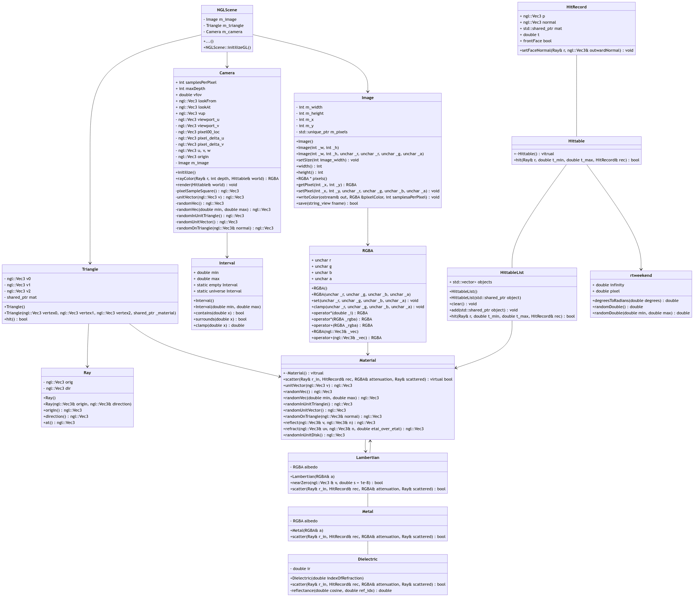
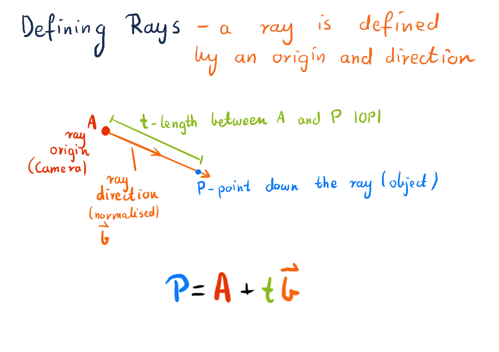
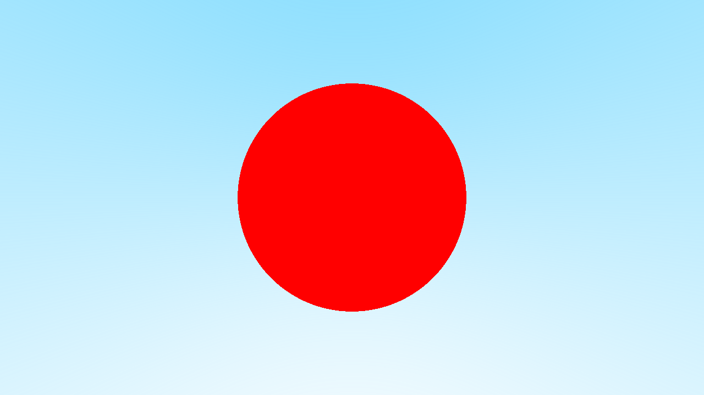
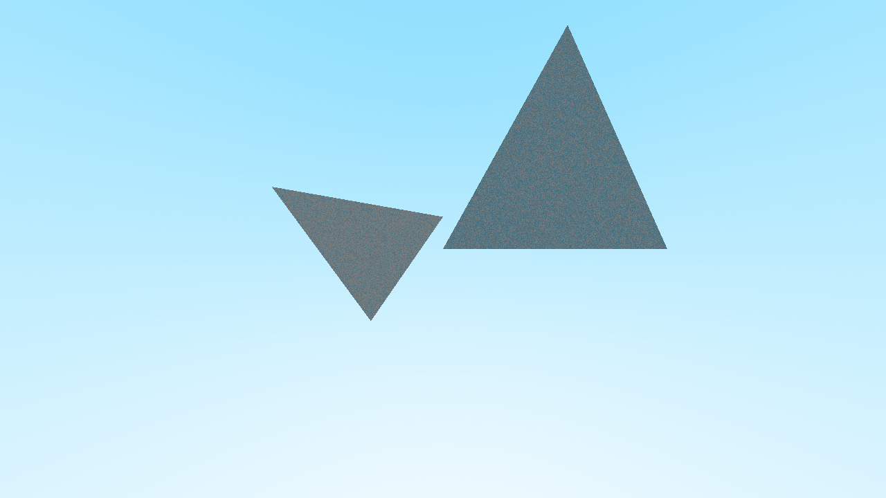
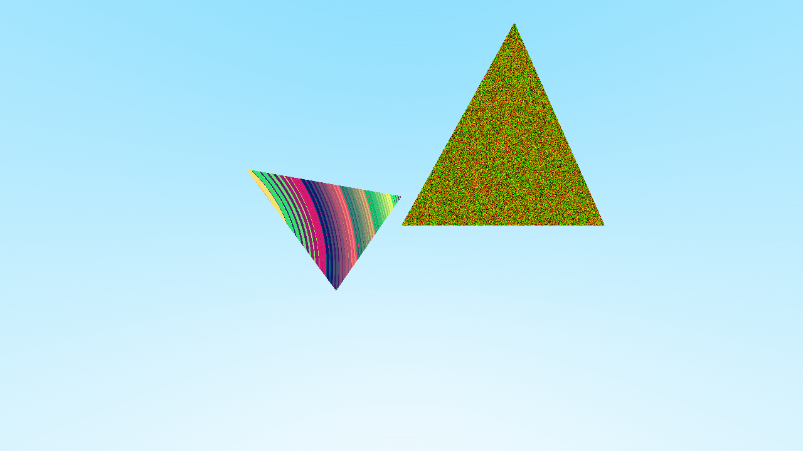
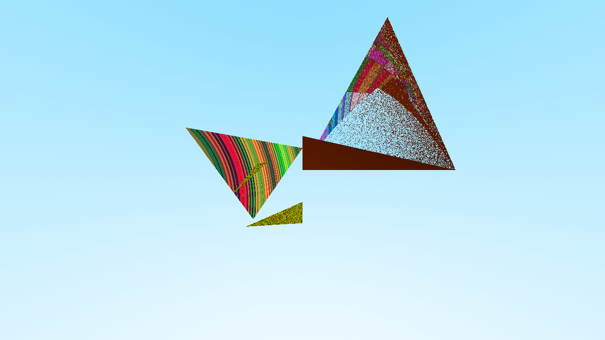
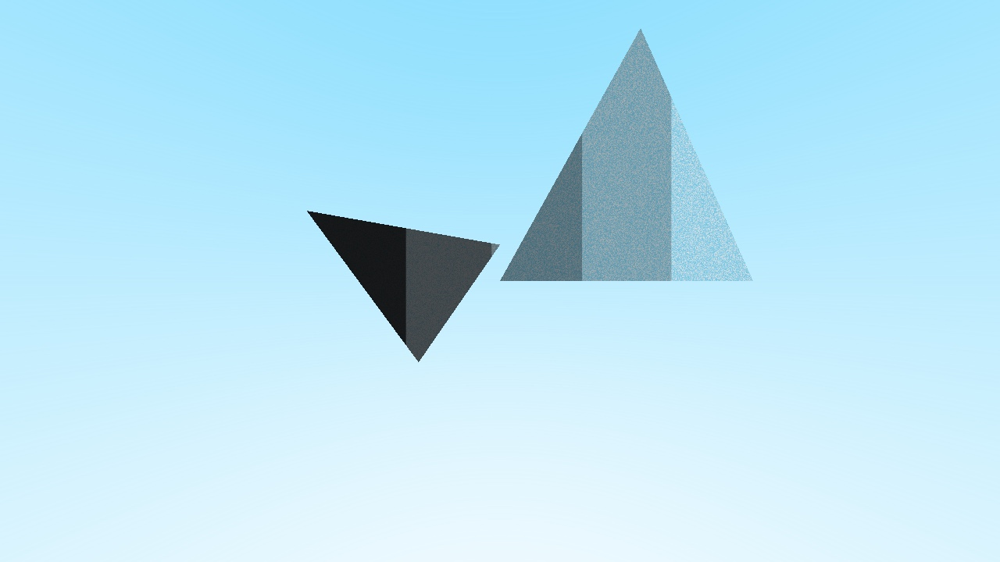
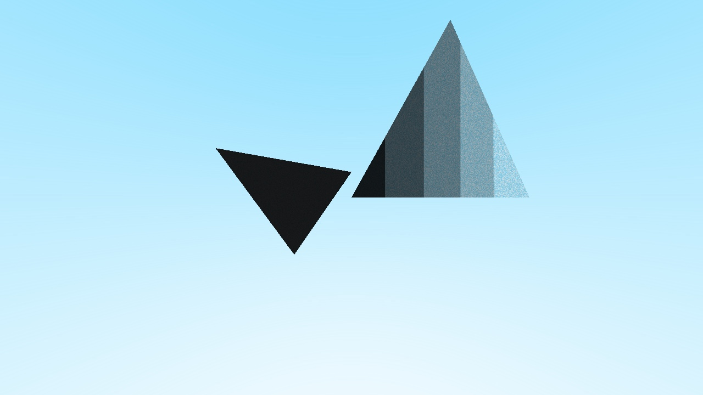
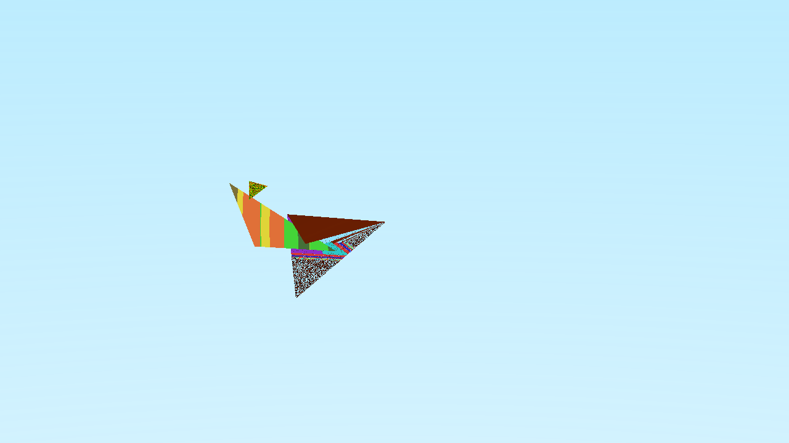
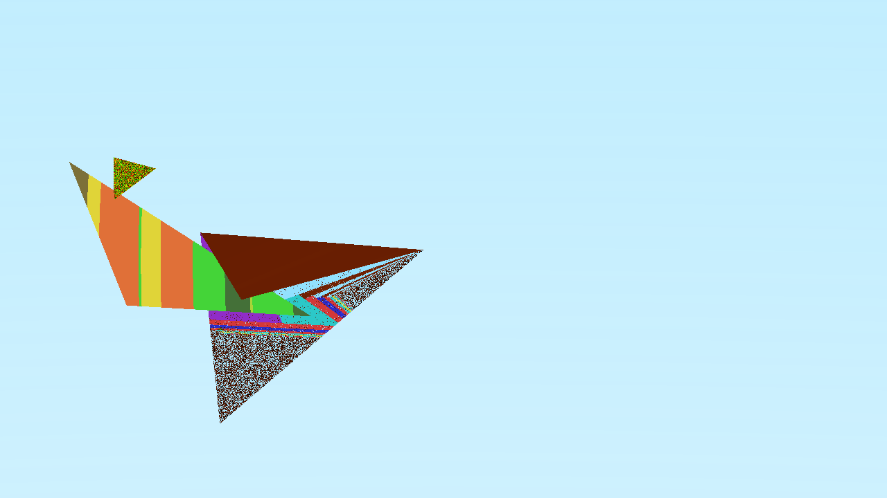

# Class Representation

To create a ray we need to create a simple Ray class such as Ray.h. Here is a simple function to describe Ray with the origin and direction:

    Ray(const ngl::Vec3& origin, const ngl::Vec3& direction) : orig(origin), dir(direction) {}

#### Ray::Ray

After using this solution

#### blendedValue = (1 – a) * startValue + a*endValue,

we can make it into function.

    RGBA rayColor(const Ray& r, int depth, Hittable& world)
    {
        ngl::Vec3 unitDirection = unitVector(r.direction());
        double t1 = 0.5*(unitDirection.m_y + 1.0);
        std::cout<<"t = " << t1 << "\n";
        return RGBA(255,255,255,255)*(1.0-t1) + RGBA(128,220,255,255)*t1;

    }

#### Camera::rayColor

Here is the effect of blending a blue and white together:

------------------------------------------------------------------------------------
Peter Shirley renders with spheres and to test how it works, I also did so and here is the result:

Then I went on to create the triangles instead.

To create a simple triangle mesh we need three vertices. In the function below we call three vertices and a material:

    Triangle(const ngl::Vec3 vertex0,const ngl::Vec3 vertex1,const ngl::Vec3 vertex2, shared_ptr<Material> _material) : v0(vertex0), v1(vertex1), v2(vertex2), mat(_material) {};

This hit function is based on the Möller–Trumbore intersection algorithm:

    bool hit(const Ray& r, double t_min, double t_max, HitRecord& rec)
    {
        float epsilon = 0.000001;

        ngl::Vec3 edge1 = v1 - v0;
        ngl::Vec3 edge2 = v2 - v0;
        ngl::Vec3 cross_ray_edge2 = r.direction().cross(edge2);
        float det = edge1.dot(cross_ray_edge2);

        if (det < epsilon)
            return false;

        if (fabs(det) < epsilon)
            return false;

        float invDet = 1 / det;

        ngl::Vec3 tvec = r.origin() - v0;

        float u = tvec.dot(cross_ray_edge2) * invDet;
        if ( u < 0 || u > 1 )
            return false;

        ngl::Vec3 qvec = tvec.cross(edge1);
        float v = r.direction().dot(qvec) * invDet;
        if ( v < 0 || u + v > 1)
            return false;

        float tt = edge2.dot(qvec) * invDet;

        return true;
    }

#### Traingle::hit

Here is a result after implementing the function from above:

Next, in order to calculate the normal by using the cross product of the two edges of the created triangle I added this piece to the end of the above function:

    rec.t = tt,
    rec.p = r.at(rec.t);
    rec.normal = (edge1.cross(edge2));
    rec.normal.normalize();
    rec.setFaceNormal(r, rec.normal);
    rec.mat = mat;

#### Triangle::hit

And here is the first render with some normals:

-------------------------------------------------------------------------------------------------------------------------------------
Material class is where I implemented all the techniques needed for creating the materials.
I started with Diffuse:

Then I applied the Lambert’s Cosine Law and ended up with a very similar render:

    class Lambertian : public Material
    {
        public:
        Lambertian(const RGBA& a) : albedo(a) {}
    
         bool nearZero(const ngl::Vec3 & v, double s = 1e-8)
        {
            return (fabs(v.m_x) < s) &&
                   (fabs(v.m_y) < s) &&
                   (fabs(v.m_z) < s);
        }
    
        bool scatter(const Ray& r_in, const HitRecord& rec, RGBA& attenuation, Ray& scattered)
        {
            auto scatterDir = rec.normal + randomUnitVector();
    
            if (nearZero(scatterDir))
                scatterDir = rec.normal;
    
            scattered = Ray(rec.p, scatterDir);
            attenuation = albedo;
            return true;
        }
        private:
        RGBA albedo;
    };

#### Lambertian class

Then I created the Metal class:

    class Metal : public Material
    {
        public:
        Metal(const RGBA& a) : albedo(a) {}
    
        bool scatter(const Ray& r_in, const HitRecord& rec, RGBA& attenuation, Ray& scattered)
        {
            ngl::Vec3 reflected = reflect(unitVector(r_in.direction()), rec.normal);
            scattered = Ray(rec.p,reflected);
            attenuation = albedo;
            return true;
        }
        private:
        RGBA albedo;
    };

#### Metal class

    class Dielectric : public Material
    {
        public:
        Dielectric(double indexOfRefraction) : ir(indexOfRefraction) {}
    
        bool scatter(const Ray& r_in, const HitRecord& rec, RGBA& attenuation, Ray& scattered)
        {
            attenuation = RGBA(255,255,255,255);
            double refractionRatio = rec.frontFace ? (1.0/ir) : ir;
    
            ngl::Vec3 unitDirection = unitVector(r_in.direction());
            double cosTheta = fmin(-unitDirection.dot(rec.normal), 1.0);
            double sinTheta = sqrt(1.0 - cosTheta*cosTheta);
    
            bool cannotRefract = refractionRatio * sinTheta > 1.0;
            ngl::Vec3 direction;
    
            if (cannotRefract || reflectance(cosTheta, refractionRatio) > randomDouble())
                direction = reflect(unitDirection, rec.normal);
            else
                direction = refract(unitDirection, rec.normal, refractionRatio);
    
            scattered = Ray(rec.p, direction);
            return true;
        }
        private:
        double ir;
    
        static double reflectance(double cosine, double ref_idx)
        {
            auto r0 = (1-ref_idx) / (1+ref_idx);
            r0 = r0*r0;
            return r0 + (1-r0)*pow((1 - cosine),5);
        }
    };

#### Dielectric class

------------------------------------------------------------------------------
I applied gamma correction in Image.cpp in function Image::linearToGamma

    inline double linearToGamma(double linearComponent)
    {
        return sqrt(linearComponent);
    }

#### Image::linearToGamma

and in Image::writeColor:

    void Image::writeColor(std::ostream &out, const RGBA &pixelColor, int samplesPerPixel)
    {
        auto r = pixelColor.r;
        auto g = pixelColor.g;
        auto b = pixelColor.b;
        auto a = pixelColor.a;
    
        auto scale = 1.0 / samplesPerPixel;
        r *= scale;
        g *= scale;
        b *= scale;
    
        r = linearToGamma(r);
        g = linearToGamma(g);
        b = linearToGamma(b);
    
        static const Interval intensity(0.000, 0.999);
        std::cout << static_cast<unsigned>(intensity.clamp(r)) << ' '
            << static_cast<unsigned>(intensity.clamp(g)) << ' '
            << static_cast<unsigned>(intensity.clamp(b)) << ' '
            << static_cast<unsigned>(intensity.clamp(a)) << '\n';
    }

#### Image::writeColor

Here is the cross-section of different gammas applied:

Here is the cross-section only of one of the triangles:

-----------------------------------------------------------------------------------------
Final scene rendered before moving camera:

For camera viewing geometry I decided that rays should head along -z axis. Also, following Shirley's calculations I added some variables and functions that allow the user to manipulate the camera according to their need.

Final render zoomed out at vup = 90:

and final render zoomed in at vup = 10:

