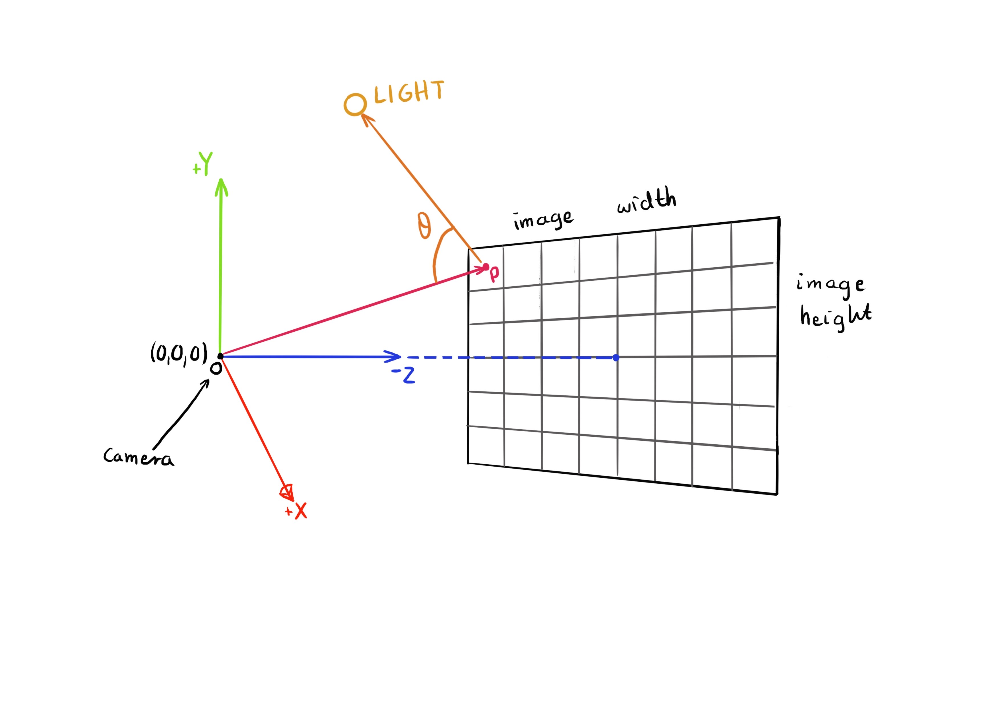

# Nina Kokot Ray tracing

## Simple Ray-Tracer with Basic Shading

### Overview

My project is a simple ray-tracer with basic shading based on the book “Ray-tracing in One Weekend” by Peter Shirley. In my implementation, I use triangles, instead of spheres. To achieve that I used the Möller–Trumbore intersection algorithm from paper “Fast, Minimum Storage Ray/Triangle Intersection” by Tomas Möller and Ben Trumbore.

As a template for my code, I used BlankNGL written by Jon Macey.

### Launch

This project depends on the NCCA Graphics Library (NGL).

There is no user interface and NGL viewport does not display anything - it is mostly there to indicate if the progaram sucessfully compiled.

In order for the user to manipulate the values of existing materials and meshes or adding some more, the user needs to modify it in the code.

IMPORTANT to notice is that the final image is being saved in the 
##### cmake folder.

-------------------------------------------------------------------------------

1. This simple raytracer allows the user to set the size of the final rendered image by changing the width. Height will be calculated according to the ratio 16:9.

   Here is a link to the line 62 from NGLScene.cpp that allows this:

https://github.com/NCCA/ase-assignment-Nonanike/blob/afe884f289e41786770a5a88f050a9382f793b48/RaytracerNGL/src/NGLScene.cpp#L62

2. If the user wants to change the material that will be displayed on the object can do so by using this piece of code:

        auto materialName = make_shared<Lambertian>(RGBA(100,100,0,255));

3. There are 3 different materials: Lambertian, Metal and Dielectric.

   Here is a link to lines 70-73 from NGLScene.cpp that allow this:

https://github.com/NCCA/ase-assignment-Nonanike/blob/afe884f289e41786770a5a88f050a9382f793b48/RaytracerNGL/src/NGLScene.cpp#L70-L73

4. Similar, the user can decide the amount of the triangle objects in the scene, the coordinates of each triangle's vertexes  and the material displayed on the meshes by simply manipulating the block of code below:

https://github.com/NCCA/ase-assignment-Nonanike/blob/afe884f289e41786770a5a88f050a9382f793b48/RaytracerNGL/src/NGLScene.cpp#L77-L80

5. The camera in this raytracer is also movable in a way that allows the user to change the coordinates of the camera and adjust the view of the scene according to the user's needs. It also give the options to change the samples per pixel, max depth and allows to zoom in or zoom out with m_camera.vfov.

https://github.com/NCCA/ase-assignment-Nonanike/blob/afe884f289e41786770a5a88f050a9382f793b48/RaytracerNGL/src/NGLScene.cpp#L82-L93

6. In order to save the final image with a new name, the user should go to the line 107 from camera.h:

https://github.com/NCCA/ase-assignment-Nonanike/blob/afe884f289e41786770a5a88f050a9382f793b48/RaytracerNGL/include/camera.h#L107

### Application of the Background Research

For Application of the Background Research please refer to Class Representation file.

### Conclusion / Future improvements

1. Adding light

2. Adding more objects, not only triangles
3. Making the materials work better
4. Adding more materials
5. Adding a bounding box
6. Creating a buffer and showing the scene in the NGL viewport
7. Creating a User Interface

### Sources

This project is based on Peter Shirley's book "Ray-tracing in One Weekend" and includes techniques descibred on the website Scratchpixel.com and uses intersection algorithm from paper “Fast, Minimum Storage Ray/Triangle Intersection” by Tomas Möller and Ben Trumbore.

Shirley, P., Black, T., Hollasch, S., 2023. Ray Tracing in One Weekend. v4.0.0-alpha.1 edition. GitHub.

Möller, T., Trumbore, B., 1997. Fast, Minimum Storage Ray/Triangle Intersection. Journal of Graphics Tools.

Scratchpixel., 2024. Ray-Tracing: Rendering a Triangle. Available from: https://www.scratchapixel.com/lessons/3d-basic-rendering/ray-tracing-rendering-a-triangle/moller-trumbore-ray-triangle-intersection.html

Scratchpixel., 2024. Introduction to Shading: Normals, Vertex Normals and Facing Ratio. Available from: https://www.scratchapixel.com/lessons/3d-basic-rendering/introduction-to-shading/shading-normals.html